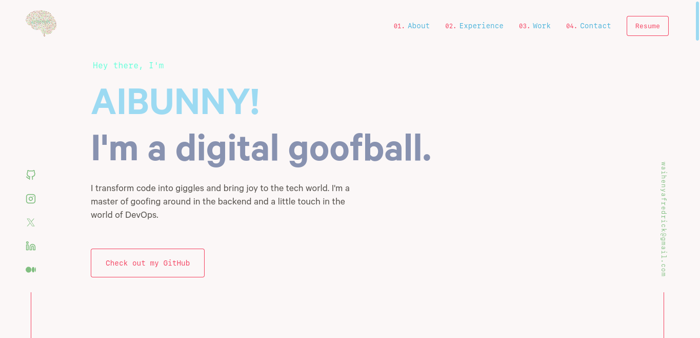

  

<h1 align="center">
  aibunny
</h1>

  The first iteration of <a href="https://www.theaibunny.com/" target="_blank">aibunny</a> built with <a href="https://www.gatsbyjs.org/" target="_blank">Gatsby</a> and hosted with <a href="https://www.vercel.com/" target="_blank">vercel</a>. Forked from the amazing <a href="https://github.com/emiliayoffie/v4/" target="_blank">Emilia Yoffie.</a> and iterated on by yours truly.

<!-- 

  

 -->

---
